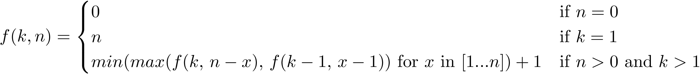

# Egg Drop Problem - Dynamic Programming
A simple dynamic programming solution to the egg drop problem

## Problem description
The problem consists of determining the minimum number of attempts that must be performed to determine the 
height at which eggs will break, given a building on n stories and a basket of k eggs. If on the building floor 
just below the floor at which an eggs breaks, it is assumed that all eggs will break above that floor and all eggs 
will not break at or below the current floor.

## Recursive Solution
The solution to this problem can be represented using the following recursive definition:

For `k` eggs, `n` floors and `x` a floor between 1 and `n`, there are two outcomes from dropping an egg:
  1. The egg does not break, reducing the number of floors to check to `n - x`, but not reducing the number of eggs
  2. The egg does break, reducing the number of floors to check to `x - 1`, and the number of eggs by 1

Thus, in order to solve the problem, we want to find the best of the worst-case scenarios for dropping
an egg at each floor. To find the worst-case for each floor, we find the max of attempts remaining
(found recursively), both for if the egg breaks and if the egg doesn't break.

Once the worst-case scenarios for each floor are found, the minimum, plus the current attempt is taken as the fewest
number of attempts that must be made to know for certain at what floor eggs begin to break.

worst-case scenario out of each possible floor being dropped from.

## Dynamic Approach
The recursive solution as it is described is incredibly inefficient. Many of the recursive calls overlap, causing 
redundant repetitions of the same problem instance.

The solution is to implement a lookup table `W` such that `W[k][n] = f(k, n)`. The problem is then solved from the
bottom up in an iterative manner, eliminating the need for costly recursion. More detailed information on the dynamic
algorithm's operation can be found in inline comments.
